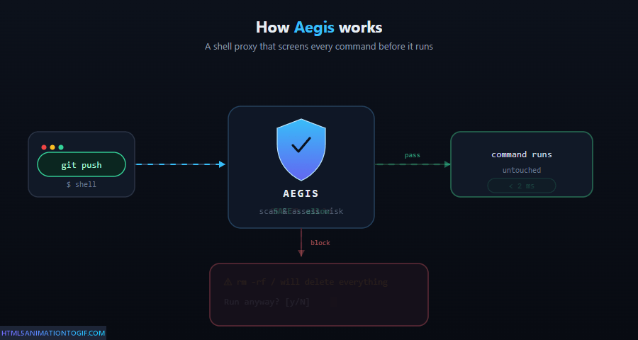

<div align="center">

# Aegis

**Shell safety for AI agents.**  
Safe commands run instantly. Dangerous ones wait for you.

[](CHANGELOG.md)
[](#how-to-install)
[](LICENSE)
[](Cargo.toml)



</div>

---

## What is Aegis?

Aegis is a Rust CLI that sits between an AI agent and your real shell. It checks every command before it runs:

| Level | What happens |
|-------|-------------|
| **Safe** | Runs immediately — no delay, no prompt |
| **Warn** | Pauses and asks for your approval |
| **Danger** | Takes a best-effort snapshot, then asks |
| **Block** | Refused outright — no prompt |

> [!NOTE]
> Aegis is a heuristic guardrail, not a sandbox or privilege boundary.
> See [`docs/threat-model.md`](docs/threat-model.md) for the full security model.

---

## Before / After

<table>
<tr>
<th width="50%">Without Aegis</th>
<th width="50%">With Aegis</th>
</tr>
<tr>
<td>

```
$ rm -rf ~/.config

[command runs silently]

$ ls ~/.config
ls: cannot access '~/.config':
No such file or directory

# Config gone. No backup.
```

</td>
<td>

```
$ rm -rf ~/.config

⚠ DANGER — FS-001 · Recursive delete
Command  rm -rf ~/.config
Risk     Danger
Pattern  FS-001 — rm with -rf flag

[A] approve  [D] deny  [i] info

● Denied.
```

</td>
</tr>
</table>

---

## Why Aegis?

AI agents can move fast and run destructive commands by mistake:

- delete files and directories
- reset or rewrite git history
- drop databases
- publish or push something unintended

Aegis adds a human checkpoint before damage happens. It also keeps an append-only audit log and can take best-effort snapshots before dangerous commands run.

---

## How to install

> [!IMPORTANT]
> **Windows:** install inside WSL2. Native PowerShell and `cmd.exe` are not supported — there is no native Windows build.

### Quick install (recommended)

```bash
curl -fsSL https://raw.githubusercontent.com/IliasAlmerekov/aegis/main/scripts/install.sh | sh
```

Installs the binary, writes a managed block to `~/.zshrc` or `~/.bashrc`, and hooks into Claude Code / Codex when those config directories already exist. Reload your shell afterwards.

### npm

```bash
npm i -g @iliasalmerekov/aegis
```

Runs `aegis install-hooks --all` automatically when Claude Code or Codex config directories are present. Set `AEGIS_NPM_SKIP_HOOKS=1` to opt out.

npm and Cargo install the binary only; neither runs the global shell installer or edits your shell startup files. Opt in with `aegis setup-shell` (see below).

### Homebrew

```bash
brew tap IliasAlmerekov/aegis
brew install aegis
```

Homebrew installs the binary only — like npm and Cargo, it does not run the global shell installer. Opt in with `aegis setup-shell`.

### Developer source install

```bash
cargo install --git https://github.com/IliasAlmerekov/aegis --tag v0.6.0 aegis
```

---

### Shell-proxy mode (package manager installs)

Package manager installs are binary-only. To opt in to shell-proxy mode:

```bash
aegis setup-shell
```

This adds a managed block to `~/.zshrc` or `~/.bashrc` that sets `SHELL` to the
aegis binary and `AEGIS_REAL_SHELL` to your real shell. Remove it with:

```bash
aegis setup-shell --remove
```

The convenience installer is **Global**-first: it installs the binary, writes the managed shell block, and sets up Claude Code / Codex hooks when those config directories already exist. The old **Local** project-only and **Binary**-only installer modes have been removed; package-manager installs are binary-only.

---

### Verify it works

```bash
aegis --version                         # prints version number
aegis -c 'echo hello'                   # safe — runs immediately, no prompt
aegis -c 'rm -rf /tmp/aegis-test'       # danger — interceptor appears, press D to deny
```

> [!TIP]
> If `echo hello` runs right away and the risky command prompts — Aegis is working.

---

## Connect to your AI agent

**Claude Code** and **Codex** are protected through `PreToolUse` hooks — not shell-proxy tricks. These hooks intercept Bash commands regardless of `$SHELL`.

```bash
# Claude Code
aegis install-hooks --claude-code

# All supported agents at once
aegis install-hooks --all
```

Re-run after upgrading to migrate any older `aegis hook` / `aegis-rewrite.sh` registration to the current shim.

> [!TIP]
> **Other agents:** for tools that respect `$SHELL`, run `aegis setup-shell`. For an agent with a `shell` config field, find the `shell` field and set it to the output of `command -v aegis`.

---

## How it works

```
AI agent command
      │
      ▼
 Aegis parses and classifies it
      │
      ├──▶ Safe   ──▶ run immediately
      ├──▶ Warn   ──▶ ask first
      ├──▶ Danger ──▶ ask first, then snapshot if approved/configured
      └──▶ Block  ──▶ refuse
                          │
                          ▼
               real shell executes only
               what you approved
```


---

## Uninstall

```bash
curl -fsSL https://raw.githubusercontent.com/IliasAlmerekov/aegis/main/scripts/uninstall.sh | sh
```

---

## Docs

| Document | Description |
|----------|-------------|
| [Architecture decisions](docs/adr/README.md) | ADR-001 through ADR-015 |
| [Threat model](docs/threat-model.md) | Security scope and assumptions |
| [Config schema](docs/config-schema.md) | `aegis.toml` reference |
| [Platform support](docs/platform-support.md) | Linux, macOS, WSL2 details |
| [Release readiness](docs/release-readiness.md) | 1.0 gate status |
